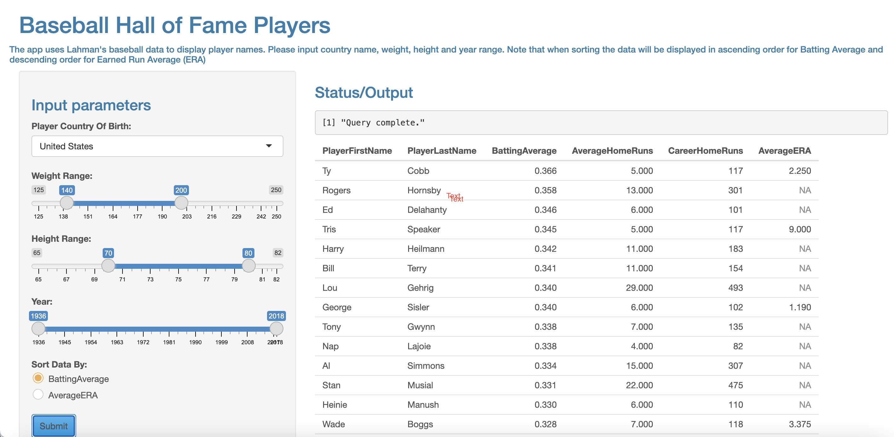

```{r setup, include=FALSE}
knitr::opts_chunk$set(echo = FALSE)
knitr::opts_chunk$set(message = FALSE)
```

## R Markdown

This is a baseball hall of fame (HOF) player search app. The app calculated the batting average using hits and at bats.

The app allows users to select Players':

- The Country of Birth
- Range of Weight (lbs) and Height (in)
- Year admitted to HOF
- Sorting by two key metrics

The user persona:

- Baseball fans that would like to identify players within a height/weight range and country of birth

## Technical Requirement - Libraries needed

- library(shiny)
- library(shinythemes)
- library(shinyWidgets)
- library(tidyverse)
- library(Lahman)

##  R Calculations (The Batting Average) and Output (example)

```{r cars, echo = TRUE}
library(shiny)
library(shinythemes)
library(shinyWidgets)
library(tidyverse)
library(Lahman)
a1<-Batting %>%
    group_by(playerID)%>%
    summarise(avg_HR = round(mean(HR, na.rm = TRUE)),
              career_HR = sum(HR, na.rm = TRUE),
              sum_H = sum(H, na.rm = TRUE),
              sum_AB = sum(AB, na.rm = TRUE))%>%
    mutate(bat_avg = round(sum_H/sum_AB,3))%>%
    select(playerID, bat_avg, avg_HR, career_HR) %>%
    arrange(desc(bat_avg))
```

## Link to the app, github and a screenshot

https://nsharma73.shinyapps.io/Baseball_HOF_Players/
https://github.com/nsharma73/ddp4

{width=75%}
```{r pressure}

```

